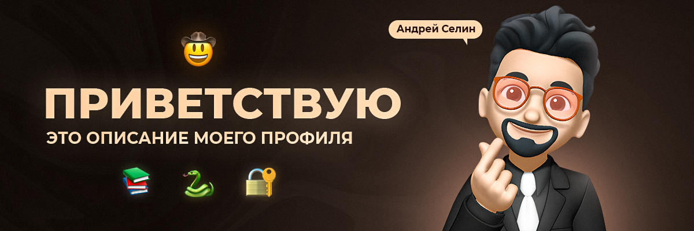

# 

## ✨ Обо мне
- Меня зовут Андрей
- Мне 20 лет 
- 3 курс "Компьютерная безопасность" (УрФУ)
- Уважаю математику, люблю футбол, занимаюсь программированием

## 🛠️ Языки и фреймворки

## 📬 Контакты

Если у вас есть вопросы или предложения, жду вашего сообщения:

- **Email:** andreyselin19@yandex.ru
- **Telegram:** [@andreyselin19](https://t.me/andreyselin19)
- **Вконтакте:** [@andreyselin19](https://vk.com/andreyselin19)

## 📊 Статистика

